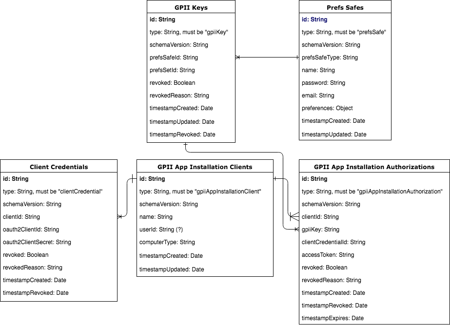
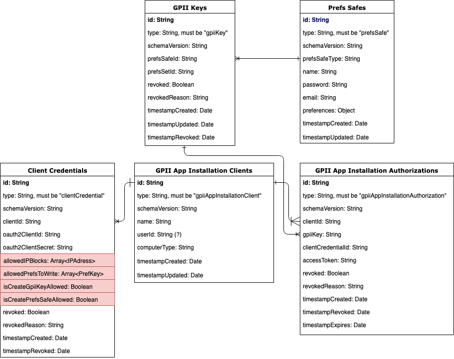
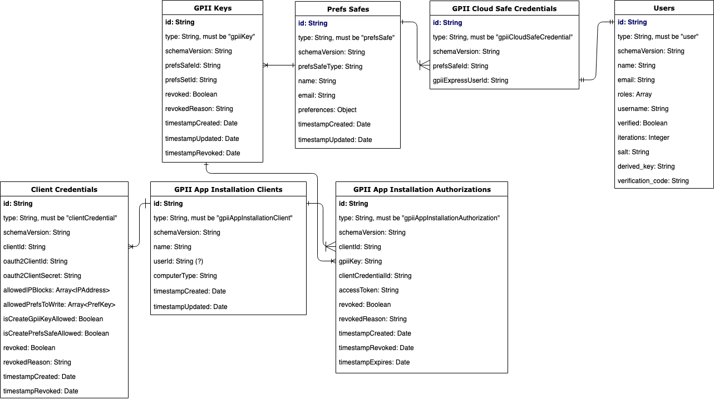

# Data Model

This documentation describes the evolution of the data model used in the [GPII project](https://wiki.gpii.net/w/Main_Page).
This data model was implemented using CouchDB but the plan is to migrate to Postgres.

Diagrams below are drawn using [Entity Relationship Model](https://en.wikipedia.org/wiki/Entity–relationship_model).
Arrows are used to express cardinality where a single line indicates "one single", and the crow's foot indicates "one
or more". For example, one `Prefs Safe` could have one or more `GPII Keys`, or in other words, one or more keys can
reference to the same preferences safe.

## Initial Data Model



## Final Data Model

This is the final data model that was used in the production when the GPII project ended. It added 4 new fields, the
red highlighted, in the `Client Credentials` document type to accommodate the requirement for adding NOVA college as
a new client.



## Future Data Model

This data model was in development when the GPII project ended. The goal was to support the user management feature
implemented using [fluid-express-user](https://github.com/fluid-project/fluid-express-user).



## Table Descriptions

### GPII Keys

| Name | Type | Required or Optional | Description | Default |
| --- | --- | --- | --- | --- |
| id | String | Required | The value of the key written onto key tokens. | None |
| type | String | Required | The document type for storing GPII keys. | The value must be "gpiiKey". |
| schemaVersion | String | Required | The version of the schema that the current document structure corresponds with. | None |
| prefsSafeId | String | Optional | The ID of the preferences safe that the GPII key connects with. Set to null if the GPII key does not have a preferences safe connected. | null |
| prefsSetId | String | Optional | The key of the preferences set in a preferences safe that the GPII key points to. The identifier matches a key within the `contexts` block of a preference set. For example, the default prefsSetId is a fixed name "gpii-default". | null |
| revoked | Boolean | Required | Whether this GPII key has been revoked. | false |
| revokedReason | String | Optional | The revoked reason. | null |
| timestampCreated | Date | Required | The timestamp when the token is created. | now() |
| timestampUpdated | Date | Optional | The timestamp when the token is updated. | null |
| timestampRevoked | Date | Optional | The timestamp when the token is revoked. | null |

### Prefs Safes

| Name | Type | Required or Optional | Description | Default |
| --- | --- | --- | --- | --- |
| id | String | Required | The ID of the preferences safe. | None |
| type | String | Required | The document type for storing preferences safes. | The value must be "prefsSafe". |
| schemaVersion | String | Required | The version of the schema that the current document structure corresponds with. | None |
| prefsSafeType | enum of ["snapset", "user"] | Required | Indicates whether this preferences safe is allowed to be modified: the ones with "snapset" type are unmodifiable while the ones with "user" type are modifiable. | "user" |
| name | String | Optional | The user defined name for the corresponding preferences safe. A pair of “preference-safe-name and password” can potentially be used as a key. | null |
| password | String | Optional | The user defined password for this preferences safe. A “preference-safe-name and password” pair can potentially be used as a key. In the future data model, this field is moved to the "Users" document that holds login information for the user management. | null |
| email | String | Optional | The user email. | null |
| preferences | Object | Required | The user preferences. Refer to the "More Document Field Examples and Explanations" section for an example of this field. | null |
| timestampCreated | Date | Required | The timestamp when the token is created. | now() |
| timestampUpdated | Date | Optional | The timestamp when the token is updated. | null |

### Client Credentials

| Name | Type | Required or Optional | Description | Default |
| --- | --- | --- | --- | --- |
| id | String | Required | The ID of the client credential. | None |
| type | String | Required | The document type for storing client credentials. | The value must be "clientCredential". |
| schemaVersion | String | Required | The version of the schema that the current document structure corresponds with. | None |
| clientId | String | Required | The client id that this client credential belongs to. | None |
| oauth2ClientId | String | Required | The unique identifier issued to a registered OAuth2 client by the authorization server. | None |
| oauth2ClientSecret | String | Required | Confidential shared secret between the client and the authorization server, used to verify the identity of the client. | None |
| revoked | Boolean | Required | Whether this client credential has been revoked. | false |
| revokedReason | String | Optional | The revoked reason. | null |
| timestampCreated | Date | Required | The timestamp when the token is created. | now() |
| timestampUpdated | Date | Optional | The timestamp when the token is updated. | null |
| timestampRevoked | Date | Optional | The timestamp when the token is revoked. | null |

### GPII App Installation Clients

| Name | Type | Required or Optional | Description | Default |
| --- | --- | --- | --- | --- |
| id | String | Required | The ID of the GPII app installation client. | None |
| type | String | Required | The document type for storing GPII app installation clients. | The value must be "gpiiAppInstallationClient". |
| schemaVersion | String | Required | The version of the schema that the current document structure corresponds with. | None |
| name | String | Required | The user provided client name.| None |
| userId or gpiiKey | String | Optional | The id of the user or the GPII key who creates this client. The intention of this field is to identify the person who manages this client. It's still in question whether this field should record userId or gpiiKey. | null |
| computerType | enum of ["public", "private", "shared by trusted parties"] | Required | Identify the type of the computer where this GPII app is installed. | None |
| timestampCreated | Date | Required | The timestamp when the token is created. | now() |
| timestampUpdated | Date | Optional | The timestamp when the token is updated. | null |

### GPII App Installation Authorizations

| Name | Type | Required or Optional | Description | Default |
| --- | --- | --- | --- | --- |
| id | String | Required | The ID of the authorization record. | None |
| type | String | Required | The document type for storing GPII app installation authorizations. | The value must be "gpiiAppInstallationAuthorization". |
| schemaVersion | String | Required | The version of the schema that the current document structure corresponds with. | None |
| clientId | String | Required | The client id that this authorization is assigned to. | None |
| gpiiKey | String | Required | The GPII key whose associated user preferences that this authorization is authorized to access. | None |
| clientCredentialId | String | Required | The client credential id that is used to request this authorization. | None |
| accessToken | String | Required | The access token used to retrieved the protected user preferences. | None |
| revoked | Boolean | Required | Whether this authorization has been revoked. | false |
| revokedReason | String | Optional | The revoked reason. | null |
| timestampCreated | Date | Required | The timestamp when the token is created. | now() |
| timestampRevoked | Date | Optional | The timestamp when the token is revoked. | null |
| timestampExpires | Date | Required | The timestamp when this authorization expires. | None |

### GPII Cloud Safe Credentials

This document only exists in the future data model. It contains the mapping data that shows which user login can access which preferences safe.

| Name | Type | Required or Optional | Description | Default |
| --- | --- | --- | --- | --- |
| id | String | Required | The ID of the safe credential record. | None |
| type | String | Required | The document type for storing GPII cloud safe credentials. | The value must be "gpiiCloudSafeCredentials". |
| schemaVersion | String | Required | The version of the schema that the current document structure corresponds with. | None |
| prefsSafeId | String | Required | The ID of the preferences safe that is allowed to be accessed by the corresponding user login. | None |
| gpiiExpressUserId | String | Required | The user ID that is authorized to access the corresponding preferences safe. | None |

### Users

This document only exists in the future data model. It contains all user login information.

| Name | Type | Required or Optional | Description | Default |
| --- | --- | --- | --- | --- |
| id | String | Required | The ID of the user record. | None |
| type | String | Required | The document type for storing users. | The value must be "user". |
| name | String | Required | The name of the user. | None |
| username | String | Required | The user name for login. | None |
| derived_key | String | Required | The encrypted version of the password for login. | None |
| verification_code | String | Required | The code sent to a user for verifying the email address. | None |
| salt | String | Required | The securely-generated random bytes that are supplied as an input parameter to [the PBKDF2 algorithm](https://cryptobook.nakov.com/mac-and-key-derivation/pbkdf2) when producing the derived key. | None |
| iterations | String | Required | The count of iterations that is supplied as an input parameter to [the PBKDF2 algorithm](https://cryptobook.nakov.com/mac-and-key-derivation/pbkdf2) for producing the derived key. | None |
| email | String | Required | The email provided by the user when signing up a new account. | None |
| roles | Array | Required | The user roles. Each user can have more than one role. For now, [fluid-express-user](https://github.com/fluid-project/fluid-express-user) only supports the role of "user". | None |
| verified | Boolean | Required | Whether the user has verified their email address. | false |

Refer to [fluid-express-user](https://github.com/fluid-project/fluid-express-user/blob/master/tests/data/users.json) for
samples of user records in the most up-to-date document structure.

## Field Examples and Explanations

### prefsSafes.preferences

Object. Required.

* Each preferences set in a preferences safe is keyed by an internally generated id. The default preferences set is keyed by a fixed string "gpii-default".
* Each preferences set contains a field called "name" that is to save the user defined name for this preferences set.

Example:

```
{
    "flat": {
        "contexts": {
            "gpii-default": {
                "name": "Default preferences",   // user defined name
                "preferences": {
                    "http://registry.gpii.net/common/highContrastEnabled": true,
                    "http://registry.gpii.net/common/highContrastTheme": "white-black",
                    "http://registry.gpii.net/common/cursorSize": 0.5
                },
                "metadata": [
                    {
                        "type": "required",
                        "scope": [
                            "http://registry.gpii.net/common/screenReaderTTSEnabled"
                        ],
                        "value": 1024
                    },
                    {
                        "type": "priority",
                        "scope": [
                            "http://registry.gpii.net/applications/com.freedomScientific.jaws"
                        ],
                        "value": 1024
                    }
                ]
            },
            "internalID-1": {
                "name": "subway",   // user defined name
                "preferences": {
                    "http://registry.gpii.net/common/highContrastEnabled": true,
                    "http://registry.gpii.net/common/highContrastTheme": "white-black",
                    "http://registry.gpii.net/common/cursorSize": 0.5
                },
                "metadata": [
                    {
                        "type": "required",
                        "scope": [
                            "http://registry.gpii.net/common/screenReaderTTSEnabled"
                        ],
                        "value": 1024
                    },
                    {
                        "type": "priority",
                        "scope": [
                            "http://registry.gpii.net/applications/com.freedomScientific.jaws"
                        ],
                        "value": 1024
                    }
                ],
                "conditions": [
                    {
                        "type": "http://registry.gpii.net/conditions/inRange",
                        "min": 400,
                        "inputPath": "http://registry\\.gpii\\.net/common/environment/illuminance"
                    }
                ]
            }
        }
    }
    "ISO24751": {
        "contexts": {
            "gpii-default": {
                "name": "Default preferences",
                "preferences": {
                    "display": {
                        "screenEnhancement": {
                            "fontSize": 24
                        }
                    },
                    "control": {
                        "onscreenKeyboard": true
                    }
                }
            }
        }
    }
}
```

### clientCredentials

This table contains all OAuth2 client credentials assigned to all OAuth clients, including: 1. GPII app installation clients;
2. Privileged prefs creator clients; 3. Web prefs consumer clients.

* At any time, each client should only have one active un-revoked client credential in this document.
* TODO: there's an ongoing discussion on whether to stop support privileged prefs creator clients and web prefs consumer clients.

```
{
    "_id": "clientCredential-1",
    "type": "clientCredential",
    "schemaVersion": "0.1",
    "clientId": "gpiiAppInstallationClient-1",
    "oauth2ClientId": "oauth2ClientId-for-NOVA",
    "oauth2ClientSecret": "oauth2ClientSecret-for-NOVA",
    "allowedIPBlocks": [
        "125.19.23.0/24",          // IPv4 block
        "2001:cdba::3257:9652",    // IPv6 block
        "62.230.58.1"              // IP string
    ],
    "allowedPrefsToWrite": [
        // common registry preferences
        "http://registry.gpii.net/common/language",
        "http://registry.gpii.net/common/DPIScale",
        "http://registry.gpii.net/common/highContrast/enabled",
        "http://registry.gpii.net/common/selfVoicing/enabled",
        // application specific preferences
        "http://registry.gpii.net/applications/com.microsoft.windows.mouseSettings"
    ],
    "isCreateGpiiKeyAllowed": true,
    "isCreatePrefsSafeAllowed": true,
    "revoked": false,
    "revokedReason": null,
    "timestampCreated": "2017-11-21T18:11:22.101Z",
    "timestampRevoked": null
}
```

## TODO list

This list will continue to expand.

* Remove ontologies
* Remove/replace all occurrences of `gpii` and `GPII`.
  * Change the name of `GPII Keys` document
  * Change the type value `gpiiKey` in `GPII Keys` document
  * Change `GPII App Installation Client` to `App Installation Client`,
  * Change its `type` from `gpiiAppInstallationClient` to `appInstallationClient`
  * Change `GPII App  Installation Authorization` to `App Installation Authorization`
  * Change its `type` `gpiiAppInstallationAuthorization` to `appInstallationAuthorization`
  * Change the `type` `gpiiExpressUserId` to `expressUserId`, or just `userId`.  How important is it that it is an express user?
* Change `contexts`, the top level within an ontology, to `prefsSets`, representing a container of named sets of preferences.
